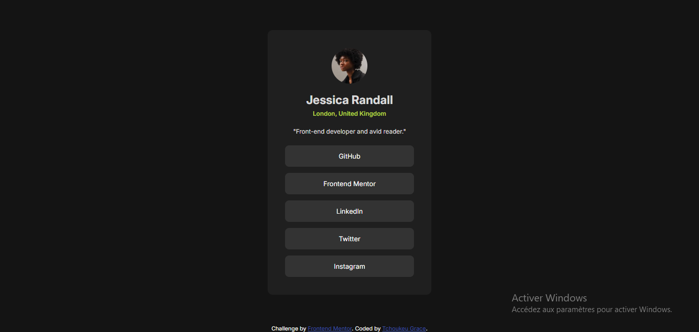
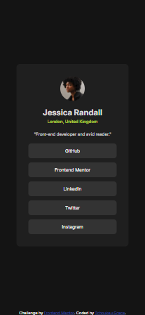

# Frontend Mentor - Social links profile solution

This is a solution to the [Social links profile challenge on Frontend Mentor](https://www.frontendmentor.io/challenges/social-links-profile-UG32l9m6dQ). Frontend Mentor challenges help you improve your coding skills by building realistic projects. 

## Table of contents

- [Overview](#overview)
  - [The challenge](#the-challenge)
  - [Screenshot](#screenshot)
  - [Links](#links)
- [My process](#my-process)
  - [Built with](#built-with)
  - [What I learned](#what-i-learned)
  - [Continued development](#continued-development)
- [Author](#author)


## Overview

### The challenge

Users should be able to:

- See hover and focus states for all interactive elements on the page

### Screenshot

#### Desktop design


#### Mobile Design


### Links

- Solution URL: [Add solution URL here](https://your-solution-url.com)
- Live Site URL: [Add live site URL here](https://your-live-site-url.com)

## My process

### Built with

- Semantic HTML5 markup
- CSS custom properties
- Flexbox


### What I learned

instead of doing a display flex to align the elements in the div block, I just used an align center and adjusted the margins of each element in the div.

```html
    <div class="block">
      
      <h1>Jessica Randall</h1>
      <h2>London, United Kingdom</h2>
    </div>
```
```css
.block{
    text-align: center;
    margin: 15px 0px 20px 0px;
    color: hsla(0, 0%, 100%, 0.836);
}
```


### Continued development

I am quite satisfied with this code, and intend to continue working to improve my code


## Author

- Frontend Mentor - [GraceAriane](https://www.frontendmentor.io/profile/GraceAriane)
- linkedIn - [Grace Ariane Tchoukeu](https://www.linkedin.com/in/grace-ariane-tchoukeu-a290b022a)


